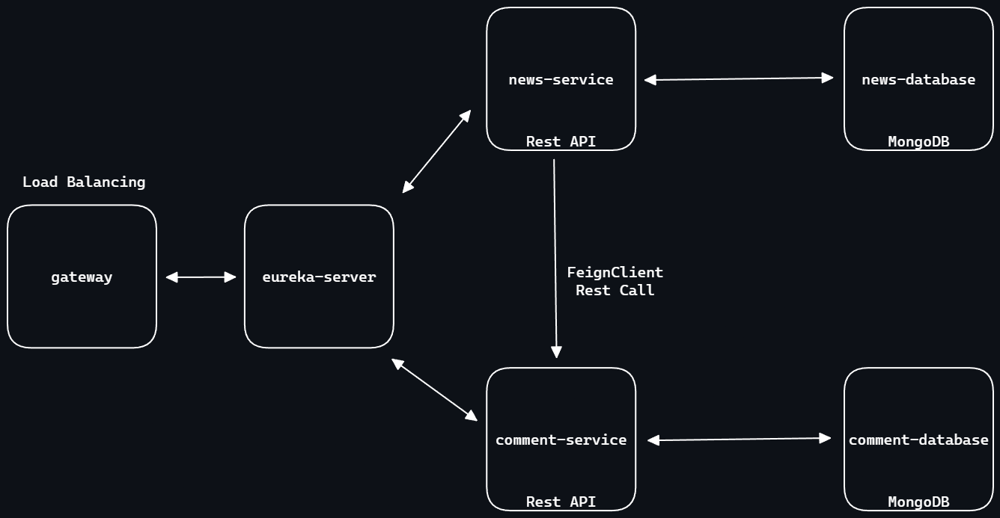

# News-Microservices

This project is a microservices-based application developed using Spring Cloud, providing a news and comment service.

## Installation and Run

The project is ready to run on Docker. Follow the steps below to get the project up and running.
1. Clone the repository:
```bash
git clone https://github.com/augurcan/news-microservices.git
```
2. Ensure Docker is installed.
3. Open the terminal in the project root directory and run the following command:

```bash
docker-compose up -d
```

## To stop the services
Open the terminal in the project root directory and run the following command:
```bash
docker-compose down
```

## Technologies and Tools

- Spring Cloud
- Eureka Server
- Gateway
- MongoDB
- Docker

## Project Structure

The project consists of two main microservices. Each service utilizes its independent MongoDB database. Eureka Server enables dynamic service discovery, and Gateway routes incoming requests.


## Services and Endpoints

1. **news-service**
	- GET
		* 'localhost:8888/v1/news/newsId': Retrieve specific news and its comments.
		* 'localhost:8888/v1/news': Retrieve all news.
	- POST
		* 'localhost:8888/v1/news':Create a new news.
			
	- PUT
		* 'localhost:8888/v1/news/newsId': Update an existing news.
	- DELETE
		* 'localhost:8888/v1/news/newsId': Delete a news.
- NewsRequest:
```json

		{
			"title":"",
			"content":"",
			"author":"",
			"category":""
		}
```

2. **comment-service**

	- GET
		* 'localhost:8888/v1/comment/news/newsId':Retrieve comments for a specific news.
	- POST
		* 'localhost:8888/v1/comment': Create a new comment.
	- PUT
		* 'localhost:8888/v1/comment/commentId': Update an existing comment.
	- DELETE
		* 'localhost:8888/v1/comment/commentId': Delete a comment.
- CommentRequest:
```json
		{
			"content":"",
			"author":"",
			"newsId":""
		}
```
